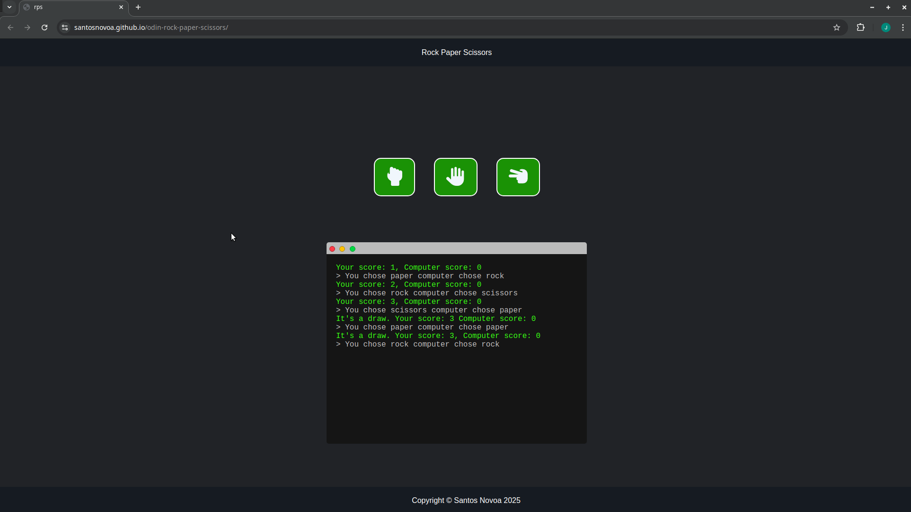

# 🪨📄✂️ Rock Paper Scissors Terminal Game

A retro terminal-inspired Rock Paper Scissors game built with HTML, CSS, and JavaScript. Play against the computer until one of you reaches 5 points. Stylish UI, fun interactions, and a nostalgic terminal feel!

---

## 🎮 Features

- Retro terminal-style UI
- Animated buttons using Font Awesome icons
- Modal overlay shows final results and offers a restart option
- Smooth scrolling output with auto-scroll that respects manual scrolling
- Fully responsive and styled with modern CSS

---

